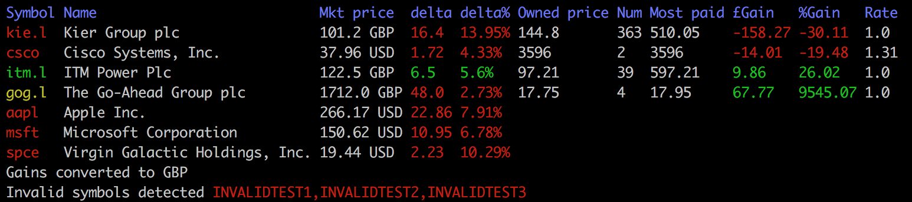

# terminal-stock-ticker
A ruby-based Ticker for tracking personal stocks and shares


# To Install

Clone Repo

Run ``` bundle install```

# To Run

Using only your holdings defined in assets.csv and defining your base currency:

  ```ruby ticker.rb -c GBP```

Along with additional symbols defining your base currency, eg of USD:

```ruby ticker.rb  -c USD tsla aapl```

Note, for non-nasdaq symbols, be careful which symbols you provide, ie LSE shares need the .l append (e.g. kie.l). All amounts in the CSV must be in the base currency provided when running.

# To add your own holdings

modify the assets.csv file, giving the prices paid in pence (or whatever your lowest denomination is).

Shares currently worth more than the highest price paid for them will be output in yellow. An Average profit/loss column will also be added.
